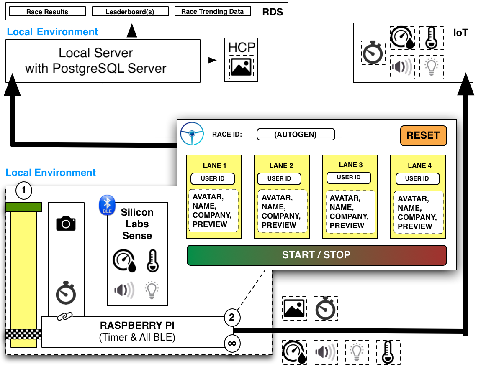

Please note that the following project is a fork of the Jive Derby project by Ryan Rutan. The original project may be found here:
https://github.com/jivesoftware/jive-derby

The following documentation is available to understand how the Data Test Track Derby operates from the ground up.  Feel free to use this solution to power your own Derby.

# Architecture Overview

## Raspberry Pi Local Environment - Raspberry Pi 3

For more details, see [README](./raspi/README.md)

## Local Server Environment - QNAP

For more details, see the [README](./service/README.md)

## External References
* [Deconstructing the Data Test Track ](https://community.hitachivantara.com/s/article/Deconstructing-the-Data-Test-Track-Derby)  
A detailed breakdown of all supporting aspects of the Data Test Track Derby, including HCP and Pentaho components.

* [Data Test Track - Rules and Restrictions](https://community.hitachivantara.com/s/article/Data-Test-Track-Derby-Rules/)  
